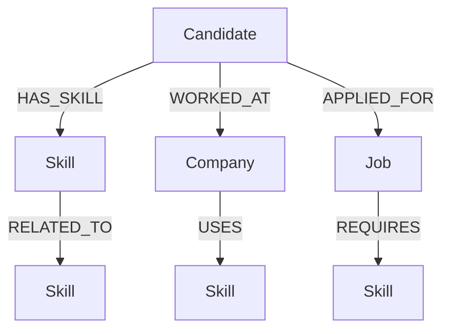

# HireGraph - Graph-Powered Talent Discovery
HireGraph is a demonstration application built for the Wexa AI Take-Home Assignment. It leverages the power of graph databases to revolutionize tech talent discovery by moving beyond basic keyword matching and utilizing multi-hop relationship traversals to find candidates based on connected skills.

## The Problem
Traditional relational databases struggle with complex, multi-layered skill relationships. If a job requires "Node.js", a standard query will only find candidates who explicitly list "Node.js". It completely misses candidates who have deep experience in "Express.js", which is highly related and often implies proficiency or rapid adaptability to "Node.js". 

## Why a Graph Database?
Graph databases naturally represent real-world connections. In HireGraph, candidates, skills, and jobs are **Nodes**, while their connections (e.g., `HAS_SKILL`, `RELATED_TO`, `REQUIRES`) are **Relationships**. 

Using a Graph Database like CognoDB allows us to:
1. **Traverse Multi-Hop Relationships Natively**: We can easily write queries that say "Find a candidate who has a skill, that is related to another skill, that is required by the job". In SQL, this requires expensive and complex `JOIN` operations that degrade performance as depth increases.
2. **Dynamic Schemas**: As new tech stacks and roles emerge, adding new relationship types (e.g., `WORKED_WITH_AT_COMPANY`) is trivial compared to schema migrations in relational DBs.
3. **Recommendation Engines**: Graph DBs are purpose-built for recommendation engines (like matching talent to jobs based on implicit connections).

## Graph Data Model
Our data model represents the ecosystem of tech talent:



**Nodes:**
- `Candidate`: Tech professionals
- `Skill`: Programming languages, frameworks, databases
- `Job`: Open roles
- `Company`: Tech companies

**Relationships:**
- `(Candidate)-[:HAS_SKILL]->(Skill)`
- `(Job)-[:REQUIRES]->(Skill)`
- `(Skill)-[:RELATED_TO]->(Skill)`

## Important Cypher Queries

### Multi-Hop Recommendation Query
This is the core graph query used in this application. It traverses multiple hops to find candidates who don't directly have the required skill, but possess a highly related skill.

```cypher
MATCH (c:Candidate)-[:HAS_SKILL]->(candidateSkill:Skill)-[:RELATED_TO]->(requiredSkill:Skill)<-[:REQUIRES]-(j:Job {id: $jobId})
RETURN c.id AS id, c.name AS name, c.experience AS experience, 
       collect(DISTINCT candidateSkill.name) AS relatedSkillsHeld,
       collect(DISTINCT requiredSkill.name) AS matchedRequiredSkills
```
*Notice the parameter `$jobId` is passed safely via the Neo4j driver, avoiding string concatenation vulnerabilities.*

## Tech Stack
- **Database**: CognoDB (Neo4j openCypher)
- **Backend**: Node.js, Express, TypeScript, Official Neo4j JS Driver
- **Frontend**: React, Vite, TypeScript, Tailwind CSS, Lucide Icons

## Getting Started

### 1. Database Setup
1. Create a free instance at [CognoDB Cloud](https://console.cognodb.com/signup).
2. Save the connection URI and password.
3. In the root of this project, rename `.env.example` to `.env` and fill in your credentials:
```env
COGNODB_URI=bolt+s://<your-instance>.databases.cognodb.cloud
COGNODB_USERNAME=cognodb
COGNODB_PASSWORD=<your-password>
```

### 2. Running the Backend
```bash
cd server
npm install
npm run dev # (If you have a dev script, or just use npx ts-node src/server.ts)
```
*Note: Before running the server, seed the database with mock data:*
```bash
npx ts-node ../database/seed.ts
```

### 3. Running the Frontend
```bash
cd client
npm install
npm run dev
```
Open `http://localhost:5173` in your browser.

## Deliverables Checklist
- [x] Full source code
- [x] Thoughtful graph data model diagram
- [x] Realistic seed data script
- [x] Multi-hop Cypher traversal query
- [x] Parameterized Cypher queries
- [x] Graceful database error handling
- [x] Clean, intentional UI (Dark mode, glassmorphism)
- [ ] **Hosted Demo Link**: [Insert link here]
- [ ] **Short Screen Recording**: [Insert link here]
